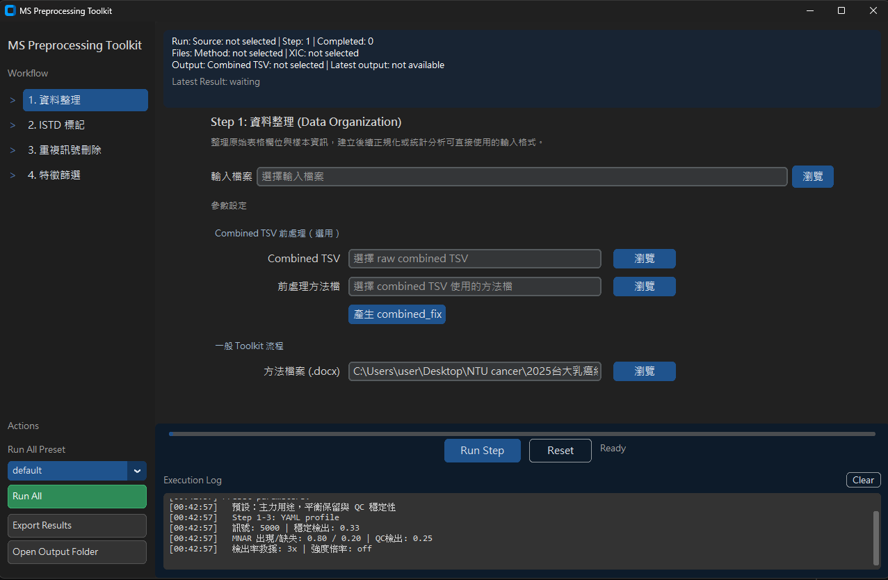
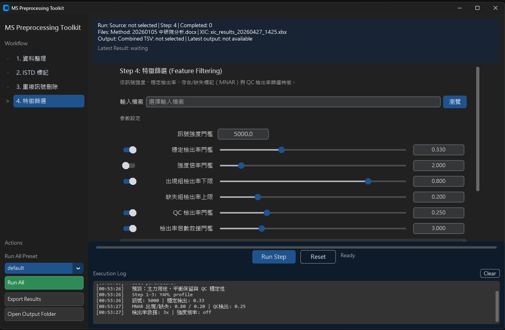

# MS Preprocessing Toolkit

[](https://www.python.org/downloads/)
[](LICENSE)
[](#installation)
[](https://github.com/Chao-hu-Lab/ms-preprocessing-toolkit/actions/workflows/ci.yml)
[](https://github.com/Chao-hu-Lab/ms-preprocessing-toolkit/actions/workflows/build.yml)
[](https://github.com/Chao-hu-Lab/ms-preprocessing-toolkit/releases)

> 質譜（Mass Spectrometry）數據前處理的整合式 GUI / CLI 工具，提供從原始 feature table 到可進入正規化與統計分析的標準化前處理流程。
>
> An integrated GUI/CLI toolkit for reproducible mass spectrometry data preprocessing — data organization, ISTD marking, duplicate removal, and feature filtering with imputation.

<p align="center">
  
</p>

<p align="center">
  <sub><b>Step 1 — 資料整理（Data Organization）</b></sub>
</p>

<details>
<summary><b>更多截圖（More Screenshots）</b></summary>

<p align="center">
  
</p>

<p align="center">
  <sub><b>Step 4 — 特徵篩選（Feature Filtering）：訊號強度 / 穩定檢出率 / MNAR / QC / 檢出率倍數救援等門檻可即時調整</b></sub>
</p>

</details>

---

## Table of Contents

- [Highlights](#highlights)
- [Quick Start](#quick-start)
- [Installation](#installation)
- [Usage](#usage)
- [Configuration](#configuration)
- [Data Format](#data-format)
- [Project Layout](#project-layout)
- [Development](#development)
- [Contributing](#contributing)
- [License](#license)
- [Acknowledgments](#acknowledgments)

---

## Highlights

- **四步驟整合流程** — 資料整理（Data Organization）→ ISTD 標記（Marking）→ 重複訊號刪除（Duplicate Removal）→ 特徵篩選與填補（Feature Filtering），全部在同一個 GUI 中串接。
- **GUI 與 CLI 雙模式** — 互動式介面（CustomTkinter）給臨床/實驗端使用者，CLI + YAML profile 支援批次重現。
- **可重現的 Profile 系統** — 內建 `loose` / `default` / `strict` 三組 profile，支援自訂 `config/presets/*.yml` 與 `${local.*}` 路徑變數。
- **Parquet 中介格式** — Step 1–3 中間結果預設以 parquet 快取，加速重跑；最終交付仍為 `.xlsx`。
- **保護機制（Protected Rows）** — ISTD 與紅字標記列可在後續步驟中被保護，避免被 Step 3/4 規則誤刪。
- **科學門檻可調** — Step 4 的穩定檢出率、出現/缺失組門檻、強度倍率、檢出率倍數救援皆可由 GUI 或 CLI 覆寫。

## Quick Start

### Option A. 一般使用者（Windows .exe）

```text
1. 從 Releases 下載：
   https://github.com/Chao-hu-Lab/ms-preprocessing-toolkit/releases/latest
2. 解壓後直接執行 ms-preprocessing.exe
3. 在 GUI 中依序操作 Step 1 → 4，或點選 Run All
```

### Option B. 從原始碼安裝（建議使用 [`uv`](https://docs.astral.sh/uv/)）

```bash
# 1. clone 專案（含 ms-core submodule）
git clone --recurse-submodules https://github.com/Chao-hu-Lab/ms-preprocessing-toolkit.git
cd ms-preprocessing-toolkit

# 2. 建立虛擬環境並安裝
uv venv
uv pip install -e .

# 3. 啟動 GUI
uv run python main.py
```

> 若 clone 時忘記加 `--recurse-submodules`，補執行：
> ```bash
> git submodule update --init --recursive
> ```

## Installation

### 環境需求

| 項目 | 版本 |
|------|------|
| Python | 3.11+ |
| OS | Windows / macOS / Linux |
| 套件管理 | 建議使用 `uv`（支援 `pip` fallback） |

<details>
<summary><b>使用 pip 安裝（如不使用 uv）</b></summary>

```bash
git clone --recurse-submodules https://github.com/Chao-hu-Lab/ms-preprocessing-toolkit.git
cd ms-preprocessing-toolkit
python -m venv .venv
# Windows: .venv\Scripts\activate
# macOS/Linux: source .venv/bin/activate
pip install -e .
```

</details>

<details>
<summary><b>進階：使用外部 ms-core checkout（development override）</b></summary>

Officially supported runtime layout: this repository plus the checked-in `ms-core` submodule.
External sibling `ms-core` checkouts are treated as a **development-only override**, not the default deployment contract.

預設執行環境為「本 repo + 內建 `ms-core` submodule」。若需指向 sibling 目錄的 `ms-core`，設定下列任一環境變數：

- `MSPTK_MS_CORE_SRC`
- `MSPTK_MS_CORE_ROOT`

此 toolkit 不會匯入、啟動或設定下游正規化專案，輸出止於 Step 4 的 `.xlsx`。
This toolkit does not import, launch, or configure downstream normalization projects — output stops at the Step 4 `.xlsx`.

</details>

## Usage

### GUI 模式

```bash
uv run python main.py
# 或安裝後
ms-preprocessing
```

### CLI 模式

```bash
# 完整流程
uv run python main.py \
  --input data.xlsx \
  --output processed.xlsx \
  --xic-results-file xic_results.xlsx

# 一次性 YAML profile
uv run python main.py \
  --input data.xlsx \
  --output processed.xlsx \
  --profile-file config/presets/lab-default.yml

# 只跑特定步驟
uv run python main.py --input data.xlsx --step istd --xic-results-file xic_results.xlsx
```

### 常用 CLI 參數

| 參數 | 說明 | 預設值 |
|------|------|--------|
| `--input, -i` | 輸入檔案路徑 | — |
| `--output, -o` | 輸出檔案路徑 | 自動產生 |
| `--step` | `organize` / `istd` / `duplicate-removal` / `filter` / `all` | `all` |
| `--profile` | 已安裝或 `config/presets/` 中的 named profile | `default` |
| `--profile-file` | 一次性 YAML profile 檔案路徑 | — |
| `--xic-results-file` | XIC Extractor 結果 workbook（Step 2 必填） | — |
| `--method-file` | 上機順序 Word 檔（`.docx`） | — |

<details>
<summary><b>完整 CLI 參數列表</b></summary>

| 參數 | 說明 | 預設值 |
|------|------|--------|
| `--mz-tol` | Step 3 重複訊號刪除 m/z 容差（ppm） | `20` |
| `--rt-tol` | Step 3 重複訊號刪除 RT 容差（分鐘） | profile |
| `--bg-threshold` | 穩定檢出率門檻 | `0.33` |
| `--high-det-thresh` | MNAR 出現組檢出率下限 | `0.80` |
| `--low-det-thresh` | MNAR 缺失組檢出率上限 | `0.20` |
| `--qc-ratio-threshold` | QC 檢出率門檻 | profile |
| `--intensity-fc-threshold` | 強度倍率門檻 | profile |
| `--ratio-rescue-threshold` | 檢出率倍數救援門檻 | profile |
| `--disable-ratio-rescue` | 停用 Step 4 檢出率倍數救援 | `false` |

> Step 2 不再支援 `--istd-mz` / `--istd-record-file` / `--istd-record-date`。
> 本機預設路徑請改用 `MSPTK_XIC_RESULTS_FILE` 環境變數，或 `config/local_reference.yml` 的 `references.xic_results_file`。

</details>

## Configuration

### Profiles

內建 Run All profiles 為打包資源，位於 `src/ms_preprocessing/resources/builtin_profiles/`，目前提供：

| Profile | 用途 |
|---------|------|
| `loose` | 寬鬆篩選，保留更多 features |
| `default` | 平衡保留與 QC 穩定性 |
| `strict` | 嚴格篩選，重視 QC reproducibility |

使用者自訂 profile 放在 config 目錄的 `presets/*.yml`；GUI 的 Run All preset 選單會自動列出，CLI 用 `--profile <name>` 呼叫。

**Config 目錄解析順序**：

1. `MSPTK_CONFIG_DIR`
2. 目前工作目錄的 `config/`
3. 打包版 `.exe` 旁的 `config/`
4. Source checkout 根目錄的 `config/`

### 本機路徑（`local_reference.yml`）

```yaml
version: 1
references:
  method_file: "C:\\path\\to\\method.docx"
  xic_results_file: "C:\\path\\to\\xic_results.xlsx"
```

Profile 中可用 `${local.method_file}`、`${local.xic_results_file}` 引用。`input` / `input_file` / `output` / `output_file` **不允許**出現在 profile 中，必須由 GUI 選檔或 CLI runtime 參數提供。

## Data Format

### 輸入支援格式

- Excel — `.xlsx`, `.xls`
- CSV — `.csv`
- TSV — `.tsv`, `.txt`

### 預期資料結構

```text
| FeatureID       | Sample1 | Sample2 | QC1  | ... |
|-----------------|---------|---------|------|-----|
| Sample_Type     | case    | case    | qc   | ... |
| 100.1234/1.50   | 5000    | 5500    | 5200 | ... |
| 200.5678/2.50   | 6000    | 6500    | 6200 | ... |
```

- 第一欄為 `FeatureID`，格式為 `m/z/RT`
- 第二列為 `Sample_Type`（樣本類型標籤）
- 舊資料若含 Tolerance 欄仍可讀取，但 Step 2 不使用此欄
- Step 2 的 `ppm tol` / `RT window` / `Mean RT` 由 XIC Extractor workbook 提供

### Sample Type 標籤

| 標籤 | 說明 |
|------|------|
| `case` | 實驗組 |
| `control` | 對照組 |
| `qc` | 品質控制樣本 |
| `blank` | 空白樣本（排除） |
| `standard` | 標準品（排除） |

> 範例輸入檔尚未提供於 repo；請使用您自有的 feature table，或從合作實驗室取得。

## Project Layout

```text
ms-preprocessing-toolkit/
├── main.py                       # 主程式入口
├── pyproject.toml                # 專案配置
├── src/ms_preprocessing/
│   ├── adapters/                 # 唯一允許 import ms_core 的層
│   ├── core/                     # 4 個處理步驟核心邏輯
│   ├── gui/                      # CustomTkinter GUI
│   ├── utils/                    # 檔案處理、驗證、結果型別
│   └── resources/builtin_profiles/  # loose / default / strict
├── ms-core/                      # git submodule (Chao-hu-Lab/ms-core)
├── config/                       # 使用者 profile 與本機路徑
├── docs/                         # 設計文件、TESTING.md
└── tests/                        # pytest 測試套件
```

## Development

完整測試策略、責任邊界與 GUI smoke check 請見 [`docs/TESTING.md`](docs/TESTING.md)。

```powershell
# 安裝 dev 依賴
uv pip install -e ".[dev]"

# 快速 smoke
$env:PYTHONPATH='ms-core/src'
uv run pytest -m smoke -v --tb=short

# 完整 top-level suite
$env:PYTHONPATH='ms-core/src'
uv run pytest tests/ -v --tb=short -x
```

### Code Style

```bash
black src/         # 格式化
ruff check src/    # Lint
mypy src/          # 型別檢查
```

### Branch Strategy

| Branch | 命名 | 用途 |
|--------|------|------|
| `master` | — | 僅供 PR 合併，禁止直接開發 |
| `feature/*` | `feature/<topic>` | 新功能 |
| `fix/*` | `fix/<topic>` | Bug 修復 |
| `chore/*` | `chore/<topic>` | CI、依賴、文件 |

建議使用 `git worktree` 隔離開發環境（`.worktrees/` 已加入 `.gitignore`）：

```bash
git worktree add .worktrees/<branch-name> -b <type>/<branch-name>
```

## Contributing

歡迎以 issue 或 PR 形式回饋。提 PR 前請確認：

1. 已從 `master` 拉出對應 `feature/*` / `fix/*` / `chore/*` branch
2. 跑過 `uv run pytest tests/ -q --tb=short -x` 全綠
3. Commit 訊息使用 [Conventional Commits](https://www.conventionalcommits.org/)（`feat:` / `fix:` / `refactor:` / `docs:` / `test:`）
4. 涉及 `ms-core` 的變更，先在 `ms-core` repo 完成 PR 與 tag，再 bump toolkit 的 submodule reference

詳見 [`CLAUDE.md`](CLAUDE.md) 中的開發守則。

<details>
<summary><b>Pipeline Contract — Unified Parquet V2</b></summary>

本專案採用 **Unified Parquet V2** 作為 Step 1–4 的中介格式契約：

- Step1-4 intermediate format = parquet
- final export = xlsx; downstream handoff is manual
- Step4 zero-as-missing default behavior

詳見 `docs/plans/2026-03-05-unified-parquet-v2-rollout-checklist.md` 與
`docs/plans/2026-03-04-step4-zero-impute-and-performance-design.md`。

</details>

## License

本專案採用 [MIT License](LICENSE)。

## Acknowledgments

本工具整合並改寫自以下既有實作：

- **ISTD 標記邏輯** — `FindSTDs_mzRT_Jia_Simplified.bas`
- **重複訊號刪除** — [ms-data-processor](https://github.com/bosschen0429/ms-data-processor)
- **特徵篩選與填補** — `Feature_barrier_V3.bas`

開發於 **Chao-hu Lab**，主要維護者 [@bosschen0429](https://github.com/bosschen0429)。
