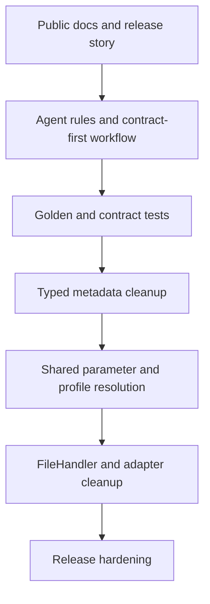

# MS Preprocessing Toolkit Stabilization Lane Implementation Plan

> **For Claude:** REQUIRED SUB-SKILL: Use superpowers:executing-plans to implement this plan task-by-task.

**Goal:** Convert the project from a feature-driven research toolkit into a contract-driven, release-ready preprocessing product without opening new algorithm scope.

**Architecture:** Stabilization work should proceed from public contract surfaces inward: README/release story, agent rules, contract tests, typed metadata, shared parameter/profile resolution, and then infrastructure cleanup. Scientific behavior changes must start from a contract document, then tests, then implementation.

**Tech Stack:** Python 3.11+, pytest, CustomTkinter, PyYAML profiles, `ms-core` submodule, GitHub Actions, optional local `graphify` architecture index.

---

## Current Diagnosis

The project has moved beyond a private prototype, but several early shortcuts still create maintenance noise:

- Pipeline contract data originally lived in dict keys, Excel sheets, and GUI widget state before `ProcessingMetadata` existed.
- GUI, CLI, adapters, export, and docs have sometimes described the same workflow rule independently.
- Step4 combines scientific decisions, schema output, and downstream imputation routing; this requires explicit contracts rather than implicit code behavior.
- Tests are strong in many local areas, but the highest-value safety net is now contract-level coverage across Step1-4, export, and downstream handoff.
- README and release docs must distinguish source-branch behavior from packaged release behavior.

## External Agent Instruction References

The `AGENTS.md` cleanup should follow patterns from mature, actively maintained
projects rather than inventing a private style. References checked on
2026-05-02:

| Project | File | Pattern adopted |
| --- | --- | --- |
| [vercel/next.js](https://github.com/vercel/next.js/blob/canary/AGENTS.md) | `AGENTS.md` | Start with codebase map, read local docs before editing, prefer fast focused tests, capture expensive output once. |
| [openai/codex](https://github.com/openai/codex/blob/main/AGENTS.md) | `AGENTS.md` | Avoid growing central modules, update docs/schemas with API changes, use scoped tests before broad tests. |
| [apache/doris](https://github.com/apache/doris/blob/master/AGENTS.md) | `AGENTS.md` | Worktree isolation, scripted build/test paths, honest release/test reporting, commit only task-related files. |
| [microsoft/playwright](https://github.com/microsoft/playwright/blob/main/CLAUDE.md) | `CLAUDE.md` | Package map, canonical lint command, explicit no-push-without-request rule, concise PR body. |
| [supabase/supabase](https://github.com/supabase/supabase/blob/master/.claude/CLAUDE.md) | `.claude/CLAUDE.md` | Short monorepo map plus conventions; keep baseline guidance compact and delegate details to skills. |
| [langchain-ai/langchain](https://github.com/langchain-ai/langchain/blob/master/AGENTS.md) | `AGENTS.md` | Public API stability, `uv` workflow, tests that fail when logic breaks, documentation as review surface. |
| [astral-sh/ruff](https://github.com/astral-sh/ruff/blob/main/AGENTS.md) | `AGENTS.md` | "If you did not test it, it is not done", prefer existing test files, review generated snapshots/artifacts. |
| [facebook/react](https://github.com/facebook/react/blob/main/CLAUDE.md) and [rust-lang/rust](https://github.com/rust-lang/rust/blob/master/src/tools/rust-analyzer/CLAUDE.md) | `CLAUDE.md` | Keep root instructions compact and let specialized subtrees own deeper invariants. |
| [wasp-lang/open-saas](https://github.com/wasp-lang/open-saas/blob/main/template/app/AGENTS.md) | `AGENTS.md` | Verify current project docs before answering or changing behavior. |
| [forrestchang/andrej-karpathy-skills](https://github.com/forrestchang/andrej-karpathy-skills) | skill/rules repo | Use caution, simplicity, and surgical edits as global coding behavior rather than project-specific rules. |
| [shanraisshan/claude-code-best-practice](https://github.com/shanraisshan/claude-code-best-practice) | guide repo | Separate global settings, project settings, commands, skills, hooks, MCP, and memory instead of packing every instruction into one file. |
| [centminmod/my-claude-code-setup](https://github.com/centminmod/my-claude-code-setup) | `CLAUDE.md` setup | Treat inspect-before-claim, parallel search, and temp cleanup as user/global operating habits, not repo-local product contracts. |
| [botingw/rulebook-ai](https://github.com/botingw/rulebook-ai) | rulebook framework | Keep portable source-of-truth rules distinct from generated assistant-specific artifacts. |
| [Bhartendu-Kumar/rules_template](https://github.com/Bhartendu-Kumar/rules_template) | rules template | Use mode-specific and shared rules to reduce token load; load deeper context only when relevant. |
| [jarrodwatts/claude-code-config](https://github.com/jarrodwatts/claude-code-config) | personal config | Split rules, skills, agents, commands, hooks, and global `CLAUDE.md` by responsibility. |
| [FrancyJGLisboa/agent-skill-creator](https://github.com/FrancyJGLisboa/agent-skill-creator) | skill generator | Move repeatable workflows into validated skills with quality/security/staleness gates. |
| [gadievron/raptor](https://github.com/gadievron/raptor) | domain agent config | Keep domain-specific operational contracts local; load specialized skill docs progressively. |
| [Piebald-AI/claude_code_system_prompts](https://github.com/Piebald-AI/claude_code_system_prompts) and [x1xhlol/system-prompts-and-models-of-ai-tools](https://github.com/x1xhlol/system-prompts-and-models-of-ai-tools) | system prompt references | Do not copy volatile system/tool behavior into repo rules unless the repo needs a stricter override. |
| [Dicklesworthstone/claude_code_agent_farm](https://github.com/Dicklesworthstone/claude_code_agent_farm) | multi-agent framework | Treat parallel-agent coordination, file claiming, and pre-flight validation as reusable orchestration rules. |

The resulting local rule is: `AGENTS.md` should contain stable execution
contracts, not every implementation detail. Deep workflow details should move
to repo skills, contract docs, or package-local docs when they become large.

### Rule Placement Decision

Keep in repo `AGENTS.md`:

- `ms-core` submodule workflow and pointer consistency
- Step1-4 contract-first development order
- downstream responsibility boundaries for toolkit, DNP, and MA
- testing marker ownership, `docs/TESTING.md`, root hygiene, release flow, and
  localized GUI text handling
- local `graphify` policy: version `.graphifyignore`, keep generated
  `graphify-out/` local

Move to global agent rules or reusable skills. If the global rule does not yet
exist, keep at most a short local safety override and avoid expanding it into a
long repo-specific procedure:

- generic search-first / inspect-before-claim behavior
- generic simplicity, no speculative abstraction, and surgical-edit guidance
- no unwanted AI signatures or co-author footers
- no push / PR publication unless the user explicitly requests it
- parallel-agent orchestration patterns and delegation prompt templates
- memory-bank frameworks, mode switching, hooks, and tool-specific setup
- progressive loading and targeted file-range reading as a general context
  budget practice

This split keeps repo instructions focused on product and repository contracts,
while global/skill rules can improve every project without increasing this
repo's instruction surface.

## Stabilization Flow



## Task 1: Close README And Release Story Gaps

**Files:**
- Modify: `README.md`
- Optional later: release notes under `docs/` if a release branch is prepared

**Steps:**

1. Remove or replace screenshots that expose local Windows paths or project-specific research names.
2. Reword Step4 from "imputation" to "imputation-routing tags" / "補值分流標記".
3. Add a source-vs-release note near Quick Start so users do not expect unreleased source-branch features in the latest `.exe`.
4. Make CLI examples PowerShell-first and copy-paste runnable, including `--xic-results-file` when `--step all` depends on Step2.
5. Correct project layout so core logic is represented by `ms-core/` and toolkit orchestration by `adapters/`, `workflow/`, `config/`, `gui/`, and `utils/`.
6. Correct contributing guidance: `ms-core` changes are merged/pushed first, then the toolkit submodule pointer is updated; tags are release-only.

**Verification:**

```powershell
git diff --check README.md
Select-String -Path README.md -Pattern 'feature filtering with imputation','特徵篩選與填補','src/ms_preprocessing/core','docs/images/gui'
```

Expected: no stale imputation wording, no removed core path, and no public screenshot references unless sanitized screenshots are intentionally reintroduced.

## Task 2: Encode Contract-First Agent Rules

**Files:**
- Modify: `AGENTS.md`

**Steps:**

1. Add a contract-first workflow rule:
   - contract document under `docs/plans/`
   - focused tests
   - implementation
   - GUI/README/handoff docs
2. Define downstream responsibility as an API contract:
   - toolkit emits Step1-4 outputs and metadata
   - DNP calibrates and passes metadata through
   - MA owns missing-value imputation and statistics
3. Add a rule that any downstream-facing column, worksheet, profile key, or metadata field needs an owner, exclusion/pass-through rule, and focused regression test.
4. Add local graphify guidance: `.graphifyignore` may be versioned, but `graphify-out/` remains local unless explicitly requested.

**Verification:**

```powershell
git diff --check AGENTS.md
Select-String -Path AGENTS.md -Pattern 'Contract-First','Downstream Boundary','graphify-out'
```

Expected: all three terms are present and no markdown formatting errors are reported.

## Task 3: Keep Graphify As A Local Architecture Index

**Files:**
- Create: `.graphifyignore`
- Modify: `.gitignore`

**Steps:**

1. Keep `.graphifyignore` strict enough to exclude Excel, CSV, TSV, parquet, local reference config, screenshots, worktrees, build artifacts, and generated output.
2. Add `graphify-out/` to `.gitignore`.
3. Use `graphify update .` for local AST refreshes only.
4. Do not install always-on Codex hooks until the generated graph proves useful across several review/refactor sessions.

**Verification:**

```powershell
git status --short
git check-ignore graphify-out/graph.json
```

Expected: `.graphifyignore` is visible for review; `graphify-out/` remains ignored.

## Task 4: Strengthen Contract Safety Nets

**Files:**
- Modify or create focused tests under `tests/`
- Modify or create focused tests under `ms-core/tests/` only when the algorithm contract lives in `ms-core`

**Steps:**

1. Keep algorithm/internal tests inside `ms-core/tests/`.
2. Keep top-level tests focused on adapter/API/export/GUI/CLI contracts.
3. Expand golden pipeline contract tests only for schema and metadata contract, not floating-value snapshots.
4. Add direct contract coverage before any new Step4, profile, export, or downstream handoff behavior change.

**Verification:**

```powershell
$env:PYTHONPATH='ms-core/src'
python -m pytest -m smoke -v --tb=short
python -m pytest -m adapter -v --tb=short
python -m pytest -m integration -v --tb=short
```

Expected: focused shards pass before deeper refactors begin.

## Task 5: Retire Legacy Context Dict After Safety Nets

**Files:**
- Modify: `src/ms_preprocessing/workflow/pipeline_session.py`
- Modify GUI/session/export consumers as discovered by tests
- Test: focused session, export, GUI, and golden contract tests

**Steps:**

1. Treat `ProcessingMetadata` as the source of truth.
2. Keep `as_context_dict()` only at explicit legacy boundaries during transition.
3. Replace direct widget or event-handler access to legacy `_context` keys with typed metadata or a read-only view.
4. Remove dict sync helpers only after final export, autosave, run summary, and GUI tests are green.

**Verification:**

```powershell
$env:PYTHONPATH='ms-core/src'
python -m pytest tests/test_results.py tests/test_gui_session_summary.py tests/test_workflow_export_service.py tests/test_golden_pipeline_contract.py -v --tb=short
```

Expected: metadata handoff remains stable and stale deleted-feature or protected-row state cannot leak between runs.

## Task 6: Normalize Parameter And Profile Resolution

**Files:**
- Modify: `src/ms_preprocessing/workflow/parameter_resolver.py`
- Modify: `src/ms_preprocessing/main.py`
- Modify GUI Run All profile application code as needed
- Test: profile, parameter resolver, CLI, and GUI event-handler tests

**Steps:**

1. Keep YAML profiles as workflow policy, not algorithm defaults.
2. Keep runtime input files outside profiles.
3. Ensure CLI explicit flags override profile values.
4. Make GUI widgets provide raw UI values; shared resolver owns canonical defaults and validation.
5. Preserve existing `ValidationWarning` behavior unless a contract document explicitly changes it.

**Verification:**

```powershell
$env:PYTHONPATH='ms-core/src'
python -m pytest tests/test_profile_loader.py tests/test_pipeline_profiles.py tests/test_parameter_resolver.py tests/test_cli_parquet_chain.py tests/test_gui_event_handlers.py -v --tb=short
```

Expected: GUI and CLI resolve equivalent workflow policy through the same profile/resolver path.

## Task 7: Defer Larger Cleanup Until Contracts Are Stable

**Deferred work:**

- Split `FileHandler` behind a compatibility facade.
- Deduplicate adapter helper code without building a large adapter framework.
- Clean remaining transitional test ownership once behavior refactors settle.
- Consider GUI widget state store only after typed metadata and parameter resolver are stable.
- Leave calibration module decomposition out of the main stabilization lane unless calibration becomes the active product focus.

**Rule:**

Do not combine these with new scientific behavior. Each cleanup should have a small contract target, focused tests, and a reversible PR scope.

## Done Definition

The stabilization lane is complete when:

- README and release docs accurately describe current source behavior and release availability.
- `AGENTS.md` enforces contract-first development and downstream boundary rules.
- `graphify-out/` no longer pollutes git status.
- New scientific/workflow changes consistently start with contract docs and tests.
- Toolkit, DNP, and MA responsibilities are documented as API boundaries.
- Contract tests catch schema and metadata drift before large refactors land.
