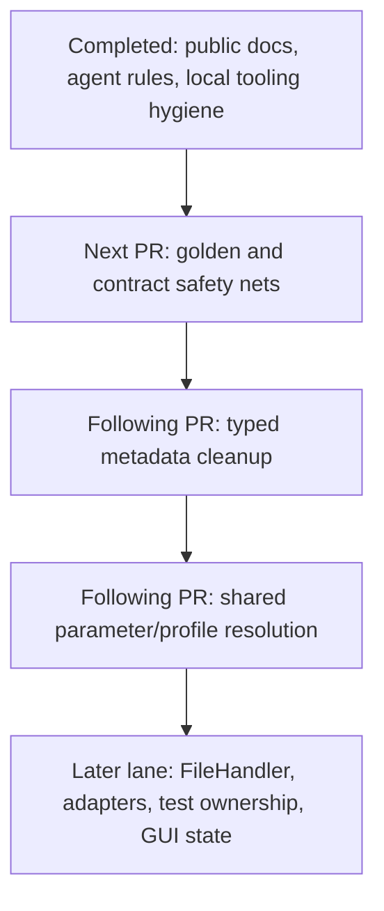

# MS Preprocessing Toolkit Stabilization Lane Plan

**Goal:** Turn the project from a feature-driven research toolkit into a contract-driven, release-ready preprocessing product without opening new algorithm scope.

**Execution rule:** Work one PR-sized phase at a time. Each phase needs a clear contract target, focused tests, implementation, verification, and a short follow-up/risk note before moving on.

**Architecture:** Stabilization proceeds from public contract surfaces inward: public docs and agent rules first, then contract safety nets, typed metadata cleanup, shared parameter/profile resolution, and finally larger infrastructure cleanup.

**Tech Stack:** Python 3.11+, pytest, CustomTkinter, PyYAML profiles, `ms-core` submodule, GitHub Actions.

---

## Current Diagnosis

The project has moved beyond a private prototype, but several early shortcuts still create maintenance noise:

- Pipeline contract data originally lived in dict keys, Excel sheets, and GUI widget state before `ProcessingMetadata` existed.
- GUI, CLI, adapters, export, and docs have sometimes described the same workflow rule independently.
- Step4 combines scientific decisions, schema output, and downstream imputation routing; this requires explicit contracts rather than implicit code behavior.
- Tests are strong in many local areas, but the highest-value safety net is now contract-level coverage across Step1-4, export, and downstream handoff.
- README and release docs must distinguish source-branch behavior from packaged release behavior.

## Adopted Planning Principles

External agent-instruction references were reviewed on 2026-05-02. The detailed bibliography is intentionally not part of this execution plan; the adopted principles are:

1. Keep repo instructions focused on product/repository contracts, not volatile agent runtime behavior.
2. Move repeatable long procedures into repo skills or package-local docs instead of growing root instructions.
3. Prefer focused, high-signal verification before broad test suites.
4. Treat documentation, schemas, profiles, and downstream handoff columns as API surfaces.
5. Do not copy old-model prompt patterns that increase process without improving outcomes.

## Stabilization Flow



## Completed On `chore/readme-revamp`

These items are no longer active implementation tasks in this plan.

### README And Release Story

**Commit:** `8d788ff docs: refresh README release story`

Completed:

- Removed public README screenshots that exposed local Windows paths and project-specific research names.
- Reworded Step4 from "imputation" to "imputation-routing tags" / "補值分流標記".
- Added a source-vs-release note near Quick Start.
- Made CLI examples PowerShell-first and copy-paste runnable.
- Corrected project layout to describe `ms-core/`, adapters, workflow, config, GUI, and utils.
- Corrected `ms-core` contributing guidance: merge/push `ms-core` first, then update the toolkit submodule pointer; tags are release-only.

Verified with:

```powershell
git diff --check
Select-String -Path README.md -Pattern 'feature filtering with imputation','特徵篩選與填補','src/ms_preprocessing/core','docs/images/gui'
```

### Contract-First Agent Rules

**Commit:** `edb04ed docs: define stabilization lane`

Completed:

- Added repo-level contract-first workflow rules in `AGENTS.md`.
- Documented downstream boundaries:
  - toolkit emits Step1-4 outputs and metadata
  - DNP calibrates and passes metadata through
  - MA owns missing-value imputation and statistics
- Added a rule that downstream-facing columns, worksheets, profile keys, and metadata fields need an owner, pass-through/exclusion behavior, and focused regression coverage.

Verified with:

```powershell
git diff --check AGENTS.md
Select-String -Path AGENTS.md -Pattern 'Contract-First','Downstream Boundary','graphify-out'
```

### Local Graphify Hygiene

**Commit:** `0bf34ef chore: add graphify local hygiene`

Completed:

- Added `.graphifyignore`.
- Added `graphify-out/` to `.gitignore`.
- Kept generated graph output local-only.

Tooling note:

- `graphify` is optional local architecture indexing, not a product stabilization milestone.
- Do not install always-on Codex hooks until generated graph output proves useful across several review/refactor sessions.

Verified with:

```powershell
git check-ignore graphify-out/graph.json
```

## Next PR: Golden And Contract Safety Nets

**Purpose:** Add the safety net required before touching legacy context dicts, typed metadata, shared resolver behavior, or export/downstream handoff code.

**In scope:**

- Top-level contract tests for Step1-4 adapter/API/export/GUI/CLI handoff.
- `ms-core/tests/` coverage only when the algorithm contract itself lives in `ms-core`.
- Golden pipeline contract snapshots for schema and metadata contracts only.
- Downstream handoff checks for toolkit -> DNP -> MA metadata pass-through/exclusion expectations.

**Out of scope:**

- Floating-value snapshots.
- New scientific rules.
- File format changes.
- GUI state-store refactors.
- FileHandler or adapter deduplication.

**Acceptance criteria:**

1. Golden tests assert contract shape for columns, `ProcessingMetadata`, `SampleInfo`, `deleted_feature_df`, protected rows, final export sheets, and Step4 tag/handoff metadata.
2. Contract tests fail if downstream-facing metadata columns silently enter numeric matrices.
3. Test placement follows ownership:
   - algorithm/internal behavior in `ms-core/tests/`
   - toolkit adapter/export/profile/GUI/CLI contracts in top-level `tests/`
4. Marker maps are updated when adding marker-owned test files.

**Stop conditions:**

- If the required contract surface cannot be tested without changing product behavior, stop and write a narrower contract doc first.
- If tests reveal inconsistent current behavior, split the behavior fix into a separate PR before continuing the cleanup lane.

**Verification:**

```powershell
$env:PYTHONPATH='ms-core/src'
python -m pytest -m smoke -v --tb=short
python -m pytest -m adapter -v --tb=short
python -m pytest -m integration -v --tb=short
```

If `ms-core/` is touched:

```powershell
Push-Location ms-core
python -m pytest tests/ -v --tb=short -x
Pop-Location
```

## Following PR: Retire Legacy Context Dict

**Purpose:** Make `ProcessingMetadata` the source of truth for pipeline state.

**Depends on:** Golden and contract safety nets passing.

**Primary files:**

- `src/ms_preprocessing/workflow/pipeline_session.py`
- GUI/session/export consumers discovered by tests
- focused session, export, GUI, and golden contract tests

**In scope:**

1. Treat `ProcessingMetadata` as the canonical session state.
2. Keep `as_context_dict()` only at explicit legacy boundaries during transition.
3. Replace direct widget or event-handler access to legacy `_context` keys with typed metadata or a read-only metadata view.
4. Remove dict sync helpers only after final export, autosave, run summary, and GUI tests are green.

**Out of scope:**

- Step algorithm changes.
- Profile schema changes.
- Broad GUI state-store replacement.

**Verification:**

```powershell
$env:PYTHONPATH='ms-core/src'
python -m pytest tests/test_results.py tests/test_gui_session_summary.py tests/test_workflow_export_service.py tests/test_golden_pipeline_contract.py -v --tb=short
```

Expected: metadata handoff remains stable, and stale deleted-feature or protected-row state cannot leak between runs.

## Following PR: Normalize Parameter And Profile Resolution

**Purpose:** Make CLI and GUI resolve equivalent workflow policy through the same profile/resolver path.

**Depends on:** Typed metadata cleanup being stable enough that GUI/session state is not being synchronized through legacy context dicts.

**Primary files:**

- `src/ms_preprocessing/workflow/parameter_resolver.py`
- `src/ms_preprocessing/main.py`
- GUI Run All profile application code as needed
- profile, parameter resolver, CLI, and GUI event-handler tests

**In scope:**

1. Keep YAML profiles as workflow policy, not algorithm defaults.
2. Keep runtime input files outside profiles.
3. Ensure CLI explicit flags override profile values.
4. Make GUI widgets provide raw UI values.
5. Make the shared resolver own canonical defaults and validation.
6. Preserve existing `ValidationWarning` behavior unless a contract document explicitly changes it.

**Out of scope:**

- Removing JSON profile compatibility unless YAML coverage is already proven and a separate migration PR is opened.
- Changing file format, worksheet names, or parquet cache wire shape.
- Adding new Step4 scientific behavior.

**Verification:**

```powershell
$env:PYTHONPATH='ms-core/src'
python -m pytest tests/test_profile_loader.py tests/test_pipeline_profiles.py tests/test_parameter_resolver.py tests/test_cli_parquet_chain.py tests/test_gui_event_handlers.py -v --tb=short
```

Expected: GUI and CLI resolve equivalent workflow policy through the same profile/resolver path, while explicit CLI flags still override profiles.

## Later Cleanup Lane

These are intentionally deferred until the contract safety net, typed metadata cleanup, and resolver cleanup are stable:

- Split `FileHandler` behind a compatibility facade.
- Deduplicate adapter helper code without building a large adapter framework.
- Clean remaining transitional test ownership once behavior refactors settle.
- Consider GUI widget state store only after typed metadata and parameter resolver are stable.
- Leave calibration module decomposition out of the main stabilization lane unless calibration becomes the active product focus.

Rule:

- Do not combine these with new scientific behavior.
- Each cleanup should have a small contract target, focused tests, and a reversible PR scope.

## Done Definition

The stabilization lane is complete when:

- README and release docs accurately describe source behavior and release availability.
- Repo `AGENTS.md` defines contract-first development and downstream boundary rules.
- Local architecture indexing no longer pollutes git status.
- New scientific/workflow changes consistently start with contract docs and tests.
- Toolkit, DNP, and MA responsibilities are documented as API boundaries.
- Contract tests catch schema and metadata drift before large refactors land.
- Legacy context dict compatibility is either removed or isolated behind explicit legacy boundaries.
- CLI and GUI parameter/profile resolution share one canonical workflow policy path.
